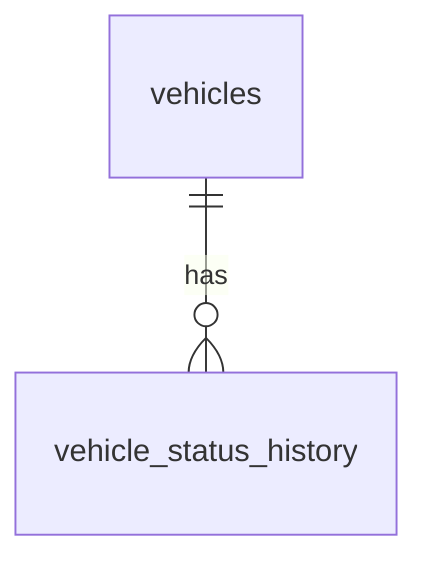

# Database Design - Car Management: Vehicle Lifecycle Management

> **Canonical ownership notice:** The `vehicle_status_history` table defined in this document is the single authoritative table for recording all vehicle lifecycle status transitions. Other TRDs that involve lifecycle status changes (e.g., FR-4 Vehicle Retirement) **must reference this table** rather than defining a separate history table.

> **Migration scripts:** The Flyway migration scripts that implement this database design are specified in [db-migrations-car-management-lifecycle.md](./db-migrations-car-management-lifecycle.md).

## Table of Contents

1. [Entity Relationship Diagram](#entity-relationship-diagram)
2. [Tables](#tables)
   - [vehicles](#vehicles)
   - [vehicle_status_history](#vehicle_status_history)

---

## Entity Relationship Diagram

---

## Tables

### vehicles

Stores each vehicle registered in the rental fleet. The `lifecycle_status` field records the vehicle's current operational state as defined in FR-2.

| Field | Data Type | Index | Constraints | Description |
|---|---|---|---|---|
| id | UUID | Primary Key | NOT NULL | Unique identifier for the vehicle |
| lifecycle_status | TEXT | Index | NOT NULL, DEFAULT 'Incoming' | Current lifecycle status of the vehicle. Allowed values: `Incoming`, `Active`, `Maintenance`, `Decommissioning`, `Sold` |
| created_at | TIMESTAMP WITH TIME ZONE | | NOT NULL | Record creation timestamp |
| updated_at | TIMESTAMP WITH TIME ZONE | | NOT NULL | Record last update timestamp |
| deleted_at | TIMESTAMP WITH TIME ZONE | | | Soft delete timestamp |
| created_by | TEXT | | NOT NULL | Username of the user who created the record |
| updated_by | TEXT | | NOT NULL | Username of the user who last updated the record |
| deleted | BOOLEAN | | NOT NULL, DEFAULT false | Soft delete flag |

> **Note:** The `vehicles` table contains additional fields defined in FR-1 (Vehicle Onboarding), FR-3 (insurance fields), and FR-5 (home_location_id). Only the fields relevant to lifecycle management are listed here.

---

### vehicle_status_history

Stores an immutable, ordered audit trail of every lifecycle status change for each vehicle. A new row is inserted on each status transition. This is the **canonical** and **single** table for lifecycle transition history; no other table should duplicate this purpose.

Records in this table are append-only — no updates or deletes are permitted.

| Field | Data Type | Index | Constraints | Description |
|---|---|---|---|---|
| id | UUID | Primary Key | NOT NULL | Unique identifier for the history record |
| vehicle_id | UUID | Index (Foreign Key) | NOT NULL, REFERENCES vehicles(id) | The vehicle whose status changed |
| previous_status | TEXT | | NOT NULL | Lifecycle status before the transition. Allowed values: `Incoming`, `Active`, `Maintenance`, `Decommissioning`, `Sold` |
| new_status | TEXT | | NOT NULL | Lifecycle status after the transition. Allowed values: `Incoming`, `Active`, `Maintenance`, `Decommissioning`, `Sold` |
| changed_by_user_id | UUID | Index (Foreign Key) | NOT NULL, REFERENCES users(id) | The user (fleet manager) who performed the transition |
| changed_at | TIMESTAMP WITH TIME ZONE | Index | NOT NULL | Timestamp when the transition occurred |
| notes | TEXT | | | Optional free-text note explaining the reason for the transition |
| created_at | TIMESTAMP WITH TIME ZONE | | NOT NULL | Record creation timestamp |
| updated_at | TIMESTAMP WITH TIME ZONE | | NOT NULL | Record last update timestamp |
| deleted_at | TIMESTAMP WITH TIME ZONE | | | Soft delete timestamp |
| created_by | TEXT | | NOT NULL | Username of the user who created the record |
| updated_by | TEXT | | NOT NULL | Username of the user who last updated the record |
| deleted | BOOLEAN | | NOT NULL, DEFAULT false | Soft delete flag |
