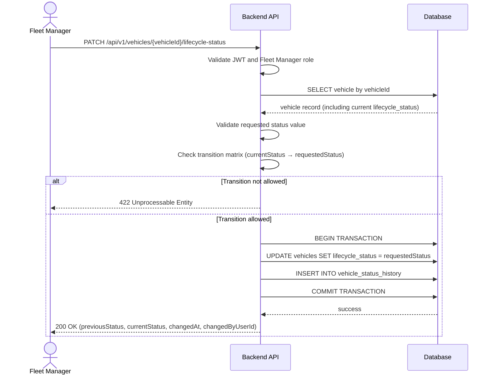

# TRD - Car Management: Vehicle Lifecycle Management

## Document Information

| Field | Details |
|---|---|
| **Feature Name** | Car Management: Vehicle Lifecycle Management |
| **Author** | @copilot |
| **Date** | |
| **Version** | |

---

## Table of Contents

1. [Background](#background)
2. [In Scope](#in-scope)
3. [Constraints](#constraints)
4. [Technical Requirements](#technical-requirements)
   - [Database Design](#database-design)
   - [Backend](#backend)
   - [Frontend](#frontend)
5. [Security Requirement](#security-requirement)
6. [Non-Functional Requirements](#non-functional-requirements)
7. [AI Usage Disclaimer](#ai-usage-disclaimer)

---

## Background

This TRD implements **FR-2: Vehicle Lifecycle Management** defined in the [PRD - Car Management](../prd/prd-car-management.md#fr-2-vehicle-lifecycle-management).

FR-2 requires that fleet managers can manually update the lifecycle status of any vehicle in the rental fleet. The system must enforce a defined set of allowed status values, restrict status transitions to valid paths, prevent status changes to vehicles in terminal state (**Sold**), and record every status change with a timestamp and the identity of the acting user. Additionally, the availability system must exclude all non-**Active** vehicles from reservation allocation.

---

## In Scope

- Defining the allowed lifecycle status values: `Incoming`, `Active`, `Maintenance`, `Decommissioning`, `Sold`.
- Enforcing a valid status transition matrix — only certain transitions between statuses are permitted.
- Treating `Sold` as a terminal state from which no further transitions are possible.
- Persisting the current lifecycle status on the vehicle record.
- Recording an immutable audit log of every status change, including the previous status, new status, timestamp, and the fleet manager who performed the change.
- REST API for a fleet manager to update a vehicle's lifecycle status.
- REST API to retrieve the full lifecycle status history for a vehicle.
- Backend enforcement that reservation allocation queries only return vehicles with lifecycle status `Active`.
- Input validation and error responses for invalid status values and disallowed transitions.

---

## Constraints

- Lifecycle status transitions are **manual only**; no automated rule triggers a status change (e.g., the system does not automatically move a vehicle to `Maintenance` when maintenance is scheduled — that is covered by FR-19/FR-20).
- This TRD does **not** cover the insurance expiry availability block (FR-3), which is a separate mechanism that temporarily prevents reservation assignment independent of lifecycle status.
- This TRD does **not** cover the conflict-check warning shown when decommissioning a vehicle with active reservations (FR-4); that warning is specified in FR-4's TRD. FR-4 writes to the `vehicle_status_history` table defined here and must not define a separate duplicate history table.
- This TRD does **not** define the full `vehicles` table schema — only the `lifecycle_status` field is in scope here. Other vehicle attributes are defined in their respective TRDs (FR-1 for onboarding fields, FR-3 for insurance fields, FR-5 for home location).
- This TRD does **not** cover the reservation allocation engine in full; it only specifies that the engine must filter on `lifecycle_status = 'Active'`.
- No role other than **Fleet Manager** may update the lifecycle status. Read access to status history may be granted to other roles but is not fully specified here.

---

## Technical Requirements

### Database Design

The database changes required for this feature are documented in [database-design-car-management-lifecycle.md](./database-design-car-management-lifecycle.md).

The following tables are relevant to this TRD:

| Table | Purpose |
|---|---|
| [vehicles](./database-design-car-management-lifecycle.md#vehicles) | Stores the current `lifecycle_status` of each vehicle |
| [vehicle_status_history](./database-design-car-management-lifecycle.md#vehicle_status_history) | Immutable audit log of every lifecycle status transition (canonical table; FR-4 and other lifecycle-aware TRDs reference this table) |

---

### Backend

#### Status Transition Matrix

A status update is only accepted if the transition from the current status to the requested status appears in the following matrix. Any other combination must be rejected with HTTP 422.

| Current Status → | Incoming | Active | Maintenance | Decommissioning | Sold |
|---|:---:|:---:|:---:|:---:|:---:|
| **Incoming** | — | ✅ | ❌ | ✅ | ❌ |
| **Active** | ❌ | — | ✅ | ✅ | ❌ |
| **Maintenance** | ❌ | ✅ | — | ✅ | ❌ |
| **Decommissioning** | ❌ | ❌ | ❌ | — | ✅ |
| **Sold** | ❌ | ❌ | ❌ | ❌ | — |

> `Sold` is a terminal state. The row for `Sold` is entirely ❌, meaning no further transitions are permitted once a vehicle reaches `Sold`.

---

#### REST API Specification

##### Update Vehicle Lifecycle Status

Updates the lifecycle status of a single vehicle. Only fleet managers are authorised to call this endpoint.

- **Method:** `PATCH`
- **URL:** `/api/v1/vehicles/{vehicleId}/lifecycle-status`
- **Path Parameters:**

  | Parameter | Type | Required | Description |
  |---|---|---|---|
  | vehicleId | UUID | Yes | Unique identifier of the vehicle |

- **Request Body (JSON):**

  | Field | Type | Required | Description |
  |---|---|---|---|
  | status | String | Yes | The target lifecycle status. Must be one of: `Incoming`, `Active`, `Maintenance`, `Decommissioning`, `Sold` |
  | notes | String | No | Optional free-text reason for the status change |

  Example:
  ```json
  {
    "status": "Active",
    "notes": "Vehicle passed pre-rental inspection."
  }
  ```

- **Response (200 OK):**

  ```json
  {
    "vehicleId": "uuid",
    "previousStatus": "Incoming",
    "currentStatus": "Active",
    "changedAt": "2024-01-15T09:30:00Z",
    "changedByUserId": "uuid"
  }
  ```

- **Error Responses:**

  | HTTP Status | Condition |
  |---|---|
  | 400 Bad Request | The `status` field is missing or contains an unrecognised value |
  | 401 Unauthorized | No valid JWT token is provided |
  | 403 Forbidden | The authenticated user does not have the Fleet Manager role |
  | 404 Not Found | No vehicle with the given `vehicleId` exists (or has been soft-deleted) |
  | 422 Unprocessable Entity | The requested transition is not permitted by the transition matrix (includes the case where the vehicle is in terminal state `Sold`) |

---

##### Get Vehicle Lifecycle History

Returns the full, ordered audit log of lifecycle status changes for a vehicle.

- **Method:** `GET`
- **URL:** `/api/v1/vehicles/{vehicleId}/lifecycle-history`
- **Path Parameters:**

  | Parameter | Type | Required | Description |
  |---|---|---|---|
  | vehicleId | UUID | Yes | Unique identifier of the vehicle |

- **Query Parameters:**

  | Parameter | Type | Required | Default | Description |
  |---|---|---|---|---|
  | page | Integer | No | 1 | Page number for pagination (1-based) |
  | pageSize | Integer | No | 20 | Number of records per page (max 100) |

- **Response (200 OK):**

  ```json
  {
    "vehicleId": "uuid",
    "totalRecords": 4,
    "page": 1,
    "pageSize": 20,
    "history": [
      {
        "id": "uuid",
        "previousStatus": "Incoming",
        "newStatus": "Active",
        "changedAt": "2024-01-15T09:30:00Z",
        "changedByUserId": "uuid",
        "notes": "Vehicle passed pre-rental inspection."
      }
    ]
  }
  ```

- **Error Responses:**

  | HTTP Status | Condition |
  |---|---|
  | 401 Unauthorized | No valid JWT token is provided |
  | 403 Forbidden | The authenticated user does not have a permitted role |
  | 404 Not Found | No vehicle with the given `vehicleId` exists (or has been soft-deleted) |

---

#### Availability Enforcement

The reservation allocation system must filter the vehicle pool so that only vehicles whose `lifecycle_status` is exactly `Active` are eligible for assignment. This filter must be applied to both the real-time availability query (FR-7) and the planned availability query (FR-8).

Other blocking conditions (e.g., insurance expiry block from FR-3, maintenance schedule block from FR-20) are additive — a vehicle must satisfy all applicable conditions to be considered available.

---

#### Algorithm: Update Lifecycle Status

```
FUNCTION updateLifecycleStatus(vehicleId, requestedStatus, notes, actingUserId, actingUserEmail):

  vehicle = fetchVehicleById(vehicleId)
  IF vehicle NOT FOUND OR vehicle.deleted = true:
    RETURN 404 Not Found

  IF requestedStatus NOT IN [Incoming, Active, Maintenance, Decommissioning, Sold]:
    RETURN 400 Bad Request ("Invalid status value")

  currentStatus = vehicle.lifecycle_status

  IF currentStatus == requestedStatus:
    RETURN 422 Unprocessable Entity ("Vehicle is already in the requested status")

  IF NOT isTransitionAllowed(currentStatus, requestedStatus):
    IF currentStatus == Sold:
      RETURN 422 Unprocessable Entity ("Sold is a terminal state; no further transitions are permitted")
    ELSE:
      RETURN 422 Unprocessable Entity ("Transition from <currentStatus> to <requestedStatus> is not permitted")

  BEGIN TRANSACTION
    UPDATE vehicles SET lifecycle_status = requestedStatus, updated_at = NOW(), updated_by = actingUserEmail
      WHERE id = vehicleId

    INSERT INTO vehicle_status_history
      (id, vehicle_id, previous_status, new_status, changed_by_user_id, changed_at, notes,
       created_at, updated_at, created_by, updated_by, deleted)
    VALUES
      (newUUID(), vehicleId, currentStatus, requestedStatus, actingUserId, NOW(), notes,
       NOW(), NOW(), actingUserEmail, actingUserEmail, false)
  COMMIT TRANSACTION

  RETURN 200 OK with { vehicleId, previousStatus: currentStatus, currentStatus: requestedStatus,
                       changedAt: NOW(), changedByUserId: actingUserId }

FUNCTION isTransitionAllowed(from, to):
  TRANSITION_MATRIX = {
    Incoming:       [Active, Decommissioning],
    Active:         [Maintenance, Decommissioning],
    Maintenance:    [Active, Decommissioning],
    Decommissioning:[Sold],
    Sold:           []
  }
  RETURN to IN TRANSITION_MATRIX[from]
```

---

#### Sequence Diagram: Update Lifecycle Status



---

### Frontend

- The lifecycle status update control must be presented as a dropdown menu showing only the statuses that are valid next transitions from the vehicle's current status, rather than all possible statuses. The `Sold` terminal state must also appear in the dropdown when the current status is `Decommissioning`, and the dropdown must be entirely disabled (read-only) when the current status is already `Sold`.
- An optional free-text **Notes** field must be displayed alongside the status dropdown, allowing the fleet manager to record a reason for the change.
- On submission, the frontend must show an inline confirmation prompt before calling the API, as lifecycle status changes are significant and irreversible (especially transitions toward `Decommissioning` or `Sold`).
- All API error responses (400, 403, 404, 422) must be surfaced as inline error messages near the status dropdown. Generic error toasts are not sufficient.
- The lifecycle history section on the vehicle detail page must render the `vehicle_status_history` records in reverse chronological order (most recent first) as a timeline or table.
- The UI must be responsive and functional on desktop browsers and tablet-sized screens.
- Frontend validation must enforce that the `status` field is present before allowing form submission; this is the only required field for this form.

---

## Security Requirement

All endpoints defined in this TRD require a valid JWT token to be present in the `Authorization` header using the Bearer scheme:

```
Authorization: Bearer <token>
```

- **JWT algorithm:** RS256 (asymmetric, using a server-held private key for signing and a distributed public key for verification).
- **Required JWT payload claims:**

  | Claim | Type | Description |
  |---|---|---|
  | `sub` | String | The authenticated user's unique identifier (used as `changed_by_user_id` in `vehicle_status_history`) |
  | `email` | String | The authenticated user's email address (stored in audit columns `created_by` / `updated_by`) |
  | `role` | String | The authenticated user's role (e.g., `fleet_manager`, `operations_manager`) |
  | `exp` | Integer | Token expiry time as a Unix timestamp |
  | `iat` | Integer | Token issued-at time as a Unix timestamp |

- **Role enforcement:**

  | Endpoint | Minimum Required Role |
  |---|---|
  | `PATCH /api/v1/vehicles/{vehicleId}/lifecycle-status` | `fleet_manager` |
  | `GET /api/v1/vehicles/{vehicleId}/lifecycle-history` | `fleet_manager` or `operations_manager` |

- The `changed_by_user_id` field stored in `vehicle_status_history` must be derived from the authenticated user's JWT `sub` claim, not from any client-supplied value in the request body.
- Tokens with an expired `exp` claim must be rejected with HTTP 401.
- Any request with a valid token but an insufficient role must be rejected with HTTP 403.

---

## Non-Functional Requirements

---

## AI Usage Disclaimer

*This document was generated with the assistance of artificial intelligence and should be reviewed by a human for accuracy and completeness.*
